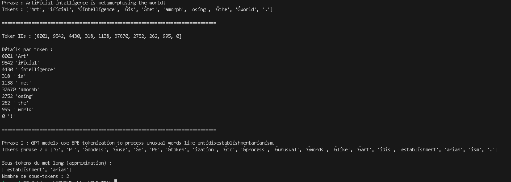
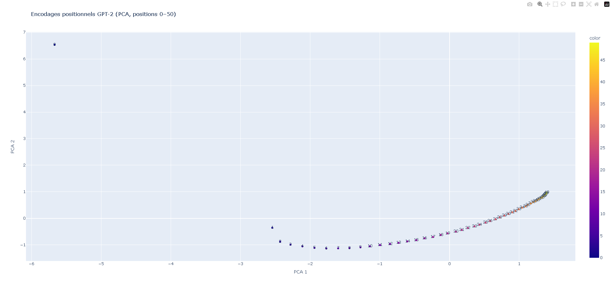
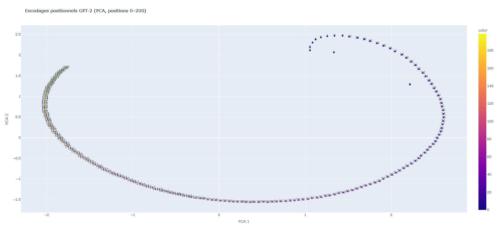
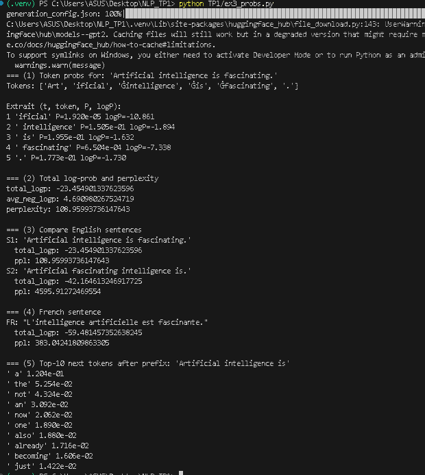
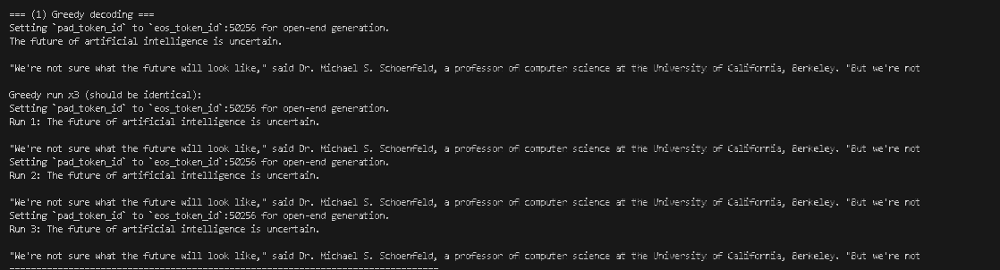
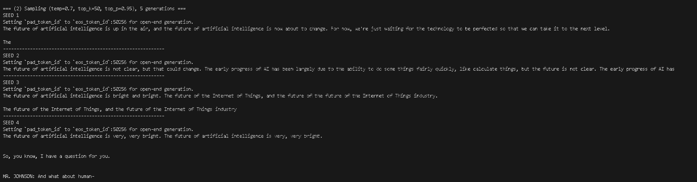
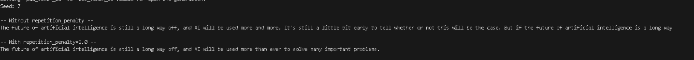
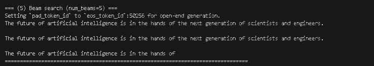
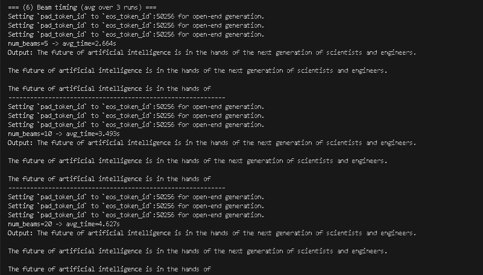

# TP1 — Tokenisation / Positional Encoding / GPT-2 (mini-rapport)

## En-tête (reproductibilité)
- **Nom / Prénom** : Jerbi Salim
- **OS** : Windows 10/11
- **Python** : Python 3.13.2
- **Commande environnement** :
  - `py -m venv .venv`
  - `.\.venv\Scripts\Activate.ps1`
  - `pip install -r TP1/requirements.txt`
- **Versions principales** :
  - `transformers== 4.57.3`
  - `torch== 2.9.1`
  - `plotly== 6.5.1`
  - `scikit-learn== 1.8.0`
- **Seed fixé** : 42

---

## Exercice 2 — Tokenisation BPE avec GPT-2
Tokens : ['Art', 'ificial', 'Ġintelligence', 'Ġis', 'Ġmet', 'amorph', 'osing', 'Ġthe', 'Ġworld', '!']

Certains tokens commencent par un symbole spécial comme "Ġ" car GPT-2 encode
explicitement les espaces. Le préfixe "Ġ" indique qu’un espace précède le token
dans le texte original. Cela permet au modèle de distinguer les débuts de mots
des sous-mots internes et de mieux gérer la structure du texte. Cette approche
est typique des tokenizers BPE utilisés par GPT-2.

Token IDs + tableau Markdown:

| Token (décodé) | Token ID | Remarque |
|----------------|----------|----------|
| Art            | 8001     | Début du mot *Artificial* |
| ificial        | 9542     | Sous-mot complétant *Artificial* |
|  intelligence  | 4430     | Mot précédé d’un espace |
|  is            | 318      | Mot très fréquent |
|  met           | 1138     | Début du mot *metamorphosing* |
| amorph         | 37670    | Fragment interne du mot long |
| osing          | 2752     | Fin du mot *metamorphosing* |
|  the           | 262      | Mot fonctionnel fréquent |
|  world         | 995      | Mot courant précédé d’un espace |
| !              | 0        | Ponctuation isolée |

Les tokens sont les unités textuelles manipulées par le modèle, tandis que les
token IDs sont leurs représentations numériques. Les modèles de langage ne
travaillent que sur des nombres, donc chaque token est associé à un identifiant
unique dans le vocabulaire.

Observations sur le découpage GPT-2 (BPE) :

1. Les mots longs ou rares sont découpés en plusieurs sous-tokens.
2. Les espaces sont intégrés directement dans les tokens via le préfixe "Ġ".
3. La ponctuation est généralement isolée dans des tokens séparés.

Ces observations illustrent le principe du Byte Pair Encoding : le vocabulaire
est constitué de fragments fréquents réutilisables, ce qui permet de représenter
n’importe quel mot, même inconnu, par une combinaison de sous-mots.

antidisestablishmentarianism :
Tokens : ['Ġant', 'idis', 'establishment', 'arian', 'ism', '.']
Le mot *antidisestablishmentarianism* est découpé en 5 sous-tokens.

Le mot antidisestablishmentarianism est très long et peu fréquent dans les
données d’entraînement, il n’est donc pas présent comme un token unique dans
le vocabulaire GPT-2. Le tokenizer BPE le découpe en plusieurs sous-mots
fréquents tels que "ant", "establishment" ou "arian". Cette stratégie permet
au modèle de représenter efficacement des mots rares en réutilisant des
fragments appris lors de l’entraînement.

## Exercice 3 — Encodages positionnels (GPT-2)

python TP1/ex2_positions.py
Shape position embeddings: (1024, 768)
n_embd: 768
n_positions: 1024
Saved TP1/positions_50.html | Variance expliquée (PCA 2D): 0.8535
Saved TP1/positions_200.html | Variance expliquée (PCA 2D): 0.8255

Interprétation de la shape :
La matrice des encodages positionnels a la shape (n_positions, n_embd).
- n_positions = nombre de positions possibles.
- n_embd = dimension de l’espace d’embedding .
Chaque ligne correspond donc à un vecteur appris qui représente une position.

Expliquer n_positions pour un LM causal :
n_positions correspond à la longueur maximale de contexte que GPT-2 peut traiter en une fois.
Dans un modèle de langage causal, la prédiction du token t dépend des tokens précédents,
mais seulement jusqu’à cette limite : au-delà de n_positions, le modèle ne peut pas voir
les tokens plus anciens.

PCA (positions 0–50)
Commande : `python TP1/ex2_positions.py`  
Fichier généré : `TP1/positions_50.html`

Capture : 

On observe que les positions proches ont tendance à être proches dans l’espace PCA, ce qui
suggère une certaine continuité dans la représentation des positions. Le nuage peut former
une trajectoire ou un chemin plutôt qu’un ensemble totalement aléatoire. Certaines zones
peuvent sembler plus denses, indiquant des positions dont les embeddings se ressemblent.
Globalement, la structure n’est pas strictement linéaire : les embeddings sont appris et
peuvent organiser les positions de façon non triviale.

Pourquoi PCA ?
Les embeddings positionnels sont en dimension n_embd, donc impossibles à visualiser
directement. La PCA projette ces vecteurs en 2D en conservant un maximum de variance, ce qui
permet d’obtenir une visualisation interprétable tout en réduisant la dimension.

PCA (positions 0–200)
Fichier généré : `TP1/positions_200.html`

Capture : 

Comparaison 0–50 vs 0–200 (obligatoire)
Quand on passe de 0–50 à 0–200, la visualisation devient souvent plus chargée :
les points sont plus nombreux, la trajectoire peut paraître plus complexe et certaines
structures visibles à petite échelle peuvent se brouiller. À l’inverse, on peut aussi
voir apparaître des motifs globaux qui n’étaient pas évidents sur 50 points.

Hypothèse 
Cela suggère que GPT-2 apprend une représentation des positions qui doit fonctionner à la fois
localement et globalement.
Les embeddings pourraient encoder des informations utiles à différentes échelles (positions
proches similaires, mais pas identiques). La structure observée en 2D est une projection :
en dimension complète, les positions peuvent être organisées de manière plus riche pour aider
l’attention à différencier et combiner correctement les informations selon leur distance.

## Exercice 4 — Probabilités, log-probabilités et perplexité (GPT-2)

Extrait des probas token par token:

Extrait (t, token, P, logP):
1 'ificial' P=1.920e-05 logP=-10.861
2 ' intelligence' P=1.505e-01 logP=-1.894
3 ' is' P=1.955e-01 logP=-1.632
4 ' fascinating' P=6.504e-04 logP=-7.338
5 '.' P=1.773e-01 logP=-1.730

GPT-2 est un modèle causal : à chaque position i, il prédit le token suivant.
Les logits à la position i correspondent donc à une distribution P(x_{i+1} | x_{\le i}).
Ainsi, pour le token observé à l’index t, on doit lire sa probabilité dans les logits
de la position t-1. Le premier token n’a pas de probabilité conditionnelle, donc on commence à t=1.

Log-proba totale + perplexité :
Total log-prob and perplexity
total_logp: -23.454901337623596
avg_neg_logp: 4.690980267524719
perplexity: 108.95993736147643

La perplexité mesure à quel point le modèle hésite sur la phrase.
C’est exp( moyenne des -log-probas ) : équivalent au nombre moyen de choix
effectifs par token. Une perplexité faible signifie que le modèle attribue de fortes
probabilités aux tokens observés.
Une perplexité élevée signifie que la phrase est peu probable : ordre étrange,
mots rares, tournure inhabituelle, ou langue moins présente dans les données.

=== (3) Compare English sentences
S1: 'Artificial intelligence is fascinating.'
  total_logp: -23.454901337623596
  ppl: 108.95993736147643
S2: 'Artificial fascinating intelligence is.'
  total_logp: -42.164613246917725
  ppl: 4595.91272469554

La phrase S2 a une perplexité plus élevée car l’ordre des mots est atypique.
GPT-2 a appris des régularités syntaxique dans ses données 
d’entraînement : “Artificial intelligence is …” est très fréquent.
Dans S2, les transitions entre tokens sont moins attendues, donc les probabilités
conditionnelles chutent et la somme des -log-probas augmente → perplexité plus grande.

=== (4) French sentence
FR: "L'intelligence artificielle est fascinante."
4 ' fascinating' P=6.504e-04 logP=-7.338
5 '.' P=1.773e-01 logP=-1.730

GPT-2 est majoritairement entraîné sur de l’anglais. Le français est présent mais moins,
donc certaines séquences de tokens sont moins probables. De plus, la tokenisation BPE 
peut découper certains mots françaisen sous-mots moins fréquents, ce qui peut aussi augmenter la perplexité.

=== (5) Top-10 next tokens after prefix: 'Artificial intelligence is'
' a' 1.204e-01
' the' 5.254e-02
' not' 4.324e-02
' an' 3.092e-02
' now' 2.062e-02
' one' 1.890e-02
' also' 1.880e-02
' already' 1.716e-02
' becoming' 1.606e-02
' just' 1.422e-02

Les propositions sont globalement plausibles.
On observe souvent des tokens qui commencent par un espace,
car GPT-2 encode l’espace dans le token. La ponctuation peut aussi apparaître si
le modèle juge probable de terminer ou de séparer la phrase.

## Exercice 5 — Génération (greedy / sampling / beam search)

- Seed utilisé : 42

On fixe un seed pour rendre la génération reproductible, surtout avec le sampling. 
Cela permet de comparer des paramètres à conditions contrôlées et d’avoir des résultats stables
entre exécutions.

Relance x3 : le résultat est identique.
Explication : le greedy est déterministe (toujours le token le plus probable à chaque étape),
donc à modèle identiques on obtient la même séquence. Le seed n’influence pas
le greedy puisqu’il n’y a pas d’échantillonnage aléatoire.

Comparaison avec greedy : 
Avec le sampling, le texte varie fortement selon le seed : on observe plus de diversité (thèmes, formulation, tournures).  
En contrepartie, certaines générations montrent des répétitions (“very, very bright” répété) ou des transitions plus abruptes (dialogue “MR. JOHNSON”).  
Le greedy est plus stable et généralement plus “linéaire”, mais peut être plus générique et moins varié.  
Le sampling permet d’explorer plusieurs suites plausibles au lieu de prendre systématiquement le token le plus probable.

Rôle des paramètres (qualitatif) :
- Température (0.7) : rend la distribution plus concentrée, donc génération plus cohérente et moins aléatoire qu’à température 1.0+.  
- top-k=50 : limite l’échantillonnage aux 50 tokens les plus probables.  
- top-p=0.95 : nucleus sampling : on conserve un ensemble dynamique de tokens couvrant 95% de la masse de probabilité, ce qui équilibre diversité et qualité.

Capture : 

Répétition : repetition_penalty=2.0 (seed contrôlé)

Commentaire :  
Avec la pénalité, la génération est plus courte et évite de répéter a long way off et des structures similaires.  
On observe souvent moins de boucles/répétitions, mais un effet secondaire possible est de forcer le texte à éviter certains mots utiles, ce qui peut raccourcir ou rendre la suite plus abrupte.

Explication :  
Une température très basse rend la génération quasi déterministe : elle privilégie fortement les tokens les plus probables, ce qui donne un texte plus cohérent mais peu divers.  
Une température très élevée aplatit la distribution : des tokens moins probables deviennent sélectionnables, donc le texte devient plus créatif mais aussi plus instable.  
Cela illustre le compromis classique : cohérence/stabilité  vs diversité/créativité.

Beam search:

Comparaison (qualitative) : 
Le beam search cherche une séquence globalement plus probable en explorant plusieurs candidats en parallèle.  
Ici, on obtient une phrase très propre et plausible, mais on voit aussi une répétition importante.  
Comparé au sampling : moins divers, plus générique et plus stable.  
Comparé au greedy : parfois plus globalement probable, mais peut aussi favoriser des répétitions si elles maintiennent une forte probabilité locale.

Impact du nombre de beams : qualité + temps

Pourquoi ça ralentit :  
Le beam search conserve num_beams séquences candidates à chaque pas de temps et doit étendre chacune d’elles.  
Augmenter le nombre de beams augmente le nombre de chemins explorés, ce qui augmente le temps de génération.  
C’est un compromis : plus d’exploration peut améliorer la probabilité globale, mais coûte plus cher en calcul.
