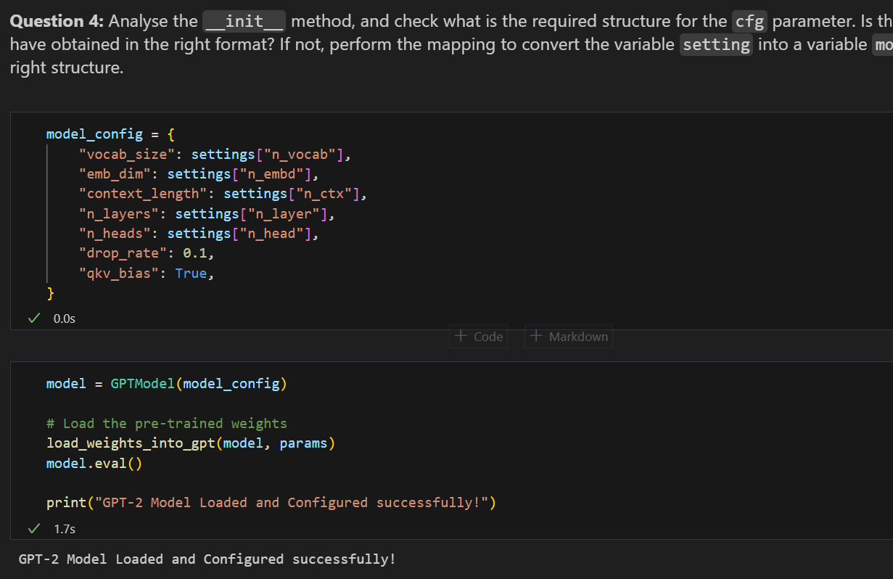
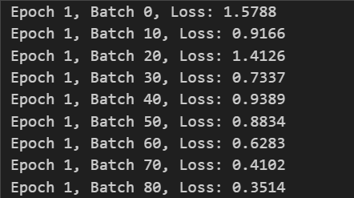
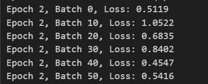
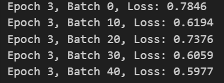
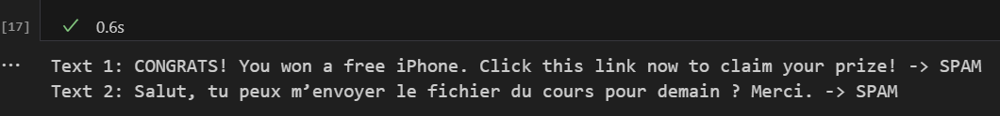

# TP2 — Fine-tuning GPT (Spam Detection)

## En-tête (reproductibilité)
- **Nom / Prénom** : Jerbi Salim
- **OS** : Windows 10/11
- **Python** : Python 3.13.2
- **Commande environnement** :
  - `py -m venv .venv`
  - `.\.venv\Scripts\Activate.ps1`
  - `pip install -r TP2/requirements.txt`
- **Versions principales** :
  - `torch==2.9.1`
- **Seed fixé** : 42

## Q2 — Type et structure de settings
settings est un dictionnaire chargé depuis hparams.json.  
**Copie de sortie :**
Type(settings): <class 'dict'>
Number of keys: 5
Keys: ['n_vocab', 'n_ctx', 'n_embd', 'n_head', 'n_layer']
n_vocab = 50257
n_ctx = 1024
n_embd = 768
n_head = 12
n_layer = 12

## Q3 — Type et structure de params
params est un dictionnaire contenant les poids du modèle GPT-2 extraits du checkpoint TensorFlow.  
Il contient notamment `wte`, `wpe`, `g`, `b` et une liste `blocks` de longueur `n_layer`.  

**Copie de sortie :**
Type(params): <class 'dict'>
Keys(params): ['blocks', 'b', 'g', 'wpe', 'wte']
Type(params['blocks']): <class 'list'>
len(params['blocks']): 12
Example block[0] keys: ['attn', 'ln_1', 'ln_2', 'mlp']
wte shape: (50257, 768)
wpe shape: (1024, 768)
g shape: (768,)
b shape: (768,)

## Q4 — Structure attendue pour `cfg` + mapping
Dans GPTModel.__init__, "cfg" doit être un dictionnaire contenant :  
`vocab_size`, `emb_dim`, `context_length`, `drop_rate`, `n_layers` (et aussi `n_heads`, `qkv_bias` car utilisés dans les blocs Transformer).  
`settings` n’a pas les mêmes noms de clés (OpenAI : `n_vocab`, `n_ctx`, `n_embd`, `n_head`, `n_layer`).  
J’ai donc créé `model_config` en mappant ces champs.

**Preuve :** 

## Q5.1 — Pourquoi df.sample(frac=1, random_state=123) ?
On mélange le dataset avant le split train/test pour éviter un split biaisé par l’ordre initial des données.  
random_state=123 rend le shuffle reproductible, donc le split est identique à chaque exécution.

## Q5.2 — Distribution des classes (train)
Le dataset est déséquilibré : il y a beaucoup plus de ham que de spam.  
Cela peut poser problème : un modèle peut obtenir une accuracy globale élevée en prédisant surtout ham, et détecter mal les spams.  
C’est pourquoi on suit une métrique spam_acc et on utilise des poids de classes.

**Preuve (copie sortie notebook) :**
train_counts = train_df["Label"].value_counts()
train_ratios = train_df["Label"].value_counts(normalize=True)

test_counts = test_df["Label"].value_counts()
test_ratios = test_df["Label"].value_counts(normalize=True)

print("Train counts:\n", train_counts)
print("\nTrain ratios:\n", train_ratios)

print("\nTest counts:\n", test_counts)
print("\nTest ratios:\n", test_ratios)

## Q6 — DataLoaders
J’ai créé train_loader (batch_size=16, shuffle=True) et test_loader (batch_size=16, shuffle=False).

**Preuve :**
Input batch shape: torch.Size([16, 120])
Target batch shape: torch.Size([16])

## Q7 — Nombre de batches
Avec train_size = 4457 et batch_size = 16, on a 279 batches par epoch.

**Preuve :** 
Train size: 4457
Batch size: 16
Number of batches per epoch: 279

## Q8 — Remplacer la tête de sortie + freeze

**Q8.1** num_classes = 2 (ham vs spam)

**Q8.2** Tête originale : Linear(emb_dim -> vocab_size) ; nouvelle tête : Linear(emb_dim -> 2).  
**Preuve :** Original output head: Linear(in_features=768, out_features=50257, bias=False)
New output head: Linear(in_features=768, out_features=2, bias=True)

**Q8.3** On gèle les couches internes pour conserver les représentations pré-entraînées de GPT-2 et n’entraîner que la tête de classification (et une petite partie finale).  
Cela réduit le coût, accélère l’entraînement et limite l’overfitting sur un dataset relativement petit/déséquilibré.

## Q9 — Boucle d’entraînement
J’ai complété la boucle : reset gradients, calcul loss, backward, optimizer.step, puis accuracy train/test.

## Q10 — Évolution de la loss / apprentissage

Sur l’epoch 1, la loss baisse globalement au fil des batches, même si elle fluctue. Cela suggère que l’optimisation avance et que la tête de classification s’ajuste.

Cependant, les métriques d’accuracy montrent un comportement anormal et instable :
- Epoch 1 : Train Acc = 47.95%, Test Acc = 52.02%, avec Spam Acc ≈ 97–98%.
- Epoch 2 : Train/Test Acc chutent à ~14%, alors que Spam Acc devient 100%.
- Epoch 3 : Train/Test Acc remontent un peu (≈ 26–28%), Spam Acc reste ≈ 99–100%.

Le fait d’avoir une Spam accuracy ~100% alors que l’accuracy globale est très faible indique que le modèle tend à prédire “spam” pour presque tout. Dans ce cas, il réussit sur les vrais spams mais se trompe massivement sur les hams, ce qui fait s’effondrer l’accuracy globale. Ce biais peut venir du déséquilibre des classes combiné aux class weights (ici, le spam est fortement sur-pondéré), ce qui pénalise beaucoup les erreurs sur spam et peut pousser le modèle à sur-prédire spam.

**Preuve :** (pour le résultats complet, voir le code)

Conclusion : la loss ne diverge pas et baisse par moments, mais les accuracies montrent que le modèle n’a pas encore appris une frontière de décision stable.

## Q12 — Now test the model on your own text : 

=======
## Q2 — Type et structure de `settings`
`settings` est un dictionnaire (`dict`) chargé depuis `hparams.json`.  
Preuve (sortie notebook) : type + liste des clés + valeurs des champs principaux (`n_vocab`, `n_ctx`, `n_embd`, `n_head`, `n_layer`).

**Copie de sortie (extrait) :**
- Type(settings): ...
- Keys: ...
- n_vocab=..., n_ctx=..., n_embd=..., n_head=..., n_layer=...

## Q3 — Type et structure de `params`
`params` est un dictionnaire (`dict`) contenant les poids du modèle GPT-2 extraits du checkpoint TensorFlow.  
Il contient notamment `wte`, `wpe`, `g`, `b` et une liste `blocks` de longueur `n_layer` (un bloc par couche Transformer).  

**Copie de sortie (extrait) :**
- Keys(params): ...
- len(params["blocks"]): ...
- shapes (wte/wpe/...) : ...

>>>>>>> b2fde0a887d48e30c63827b32d35724dc54a9501
