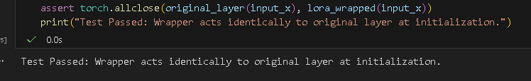
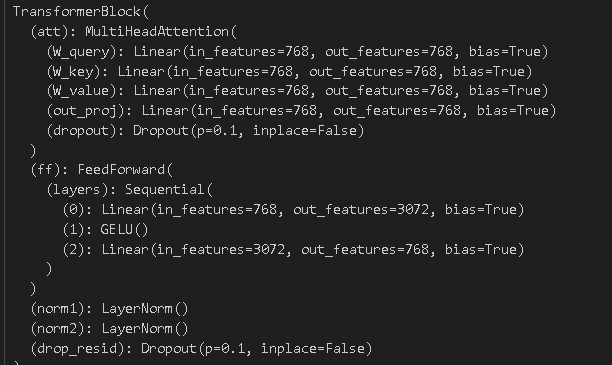
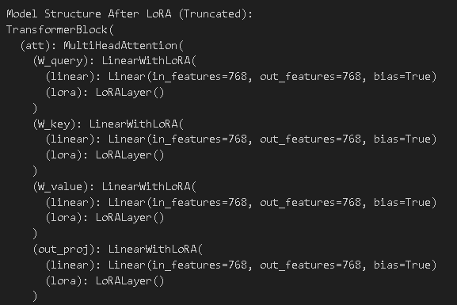
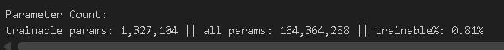
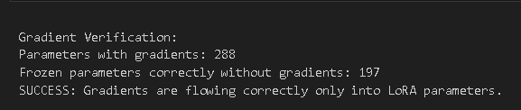
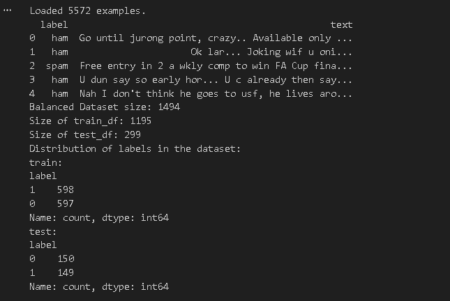
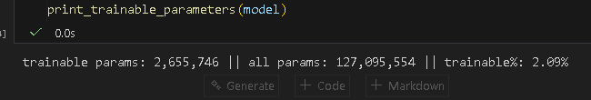
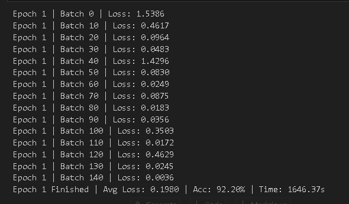

# CSC 8614 — CI3: Parameter-Efficient Fine-Tuning with LoRA (TP3)

## En-tête (reproductibilité)
- **Nom / Prénom** : Salim Jerbi
- **Environnement** : Windows (venv Python)
- **Seed** : RANDOM_STATE = 123
- **Commande d’installation** :
  - `pip install -r requirements.txt`
- **Versions principales (extrait pip)** :
  - torch==2.9.1
  - tiktoken==0.12.0
  - pandas==2.3.3
  - matplotlib==3.10.8
  - tensorflow==2.20.0
  - jupyterlab==4.5.1
---

## 1) Implémentation LoRA (Ex1 + Ex2)

### LoRALayer
J’ai implémenté la branche LoRA ΔW via deux matrices basses-rangs :
- **A** de taille `(rank, in_dim)`
- **B** de taille `(out_dim, rank)`
- scaling : `alpha / rank`
Initialisation :
- `A` : Kaiming uniform
- `B` : zéros (pour démarrer avec un modèle identique à l’original)

### LinearWithLoRA
Le wrapper additionne :
- chemin gelé : `linear(x)`
- chemin LoRA : `lora(x)`
Donc : `linear(x) + lora(x)`.

**Sanity check**
Le test passe car `B=0` au départ, donc `lora(x)=0`, donc sortie identique.

**Preuve** :

---

## 2) Injection de LoRA dans GPTModel (Ex3)

J’ai remplacé récursivement les `nn.Linear` par `LinearWithLoRA` dans tout le modèle, en excluant la tête finale `out_head`, car on ne veut généralement pas réduire la projection vocab_size.

**Q1 — Différences structurelles avant/après**
Oui, on observe que les `Linear(...)` dans l’attention et dans le feed-forward sont remplacés par :
`LinearWithLoRA(linear=Linear(...), lora=LoRALayer(...))`.

**Preuve** :

---

## 3) Gel des poids et comptage des paramètres (Ex4)

### Principe
- Je gèle tous les paramètres du modèle (`requires_grad=False`).
- Je réactive uniquement les paramètres LoRA `A` et `B` dans chaque `LinearWithLoRA`.

**Q2 — Nombre de paramètres trainables / total / fraction**

Après 1 injection LoRA :
- trainable params: 1,327,104
- all params: 164,364,288
- trainable%: 0.81%

**Preuve** :

---

## 4) Vérification des gradients

Objectif : vérifier que seuls les paramètres LoRA reçoivent des gradients.

Résultat :
- `Parameters with gradients: 288`
- `Frozen parameters correctly without gradients: 197`
- Message final : `SUCCESS: Gradients are flowing correctly only into LoRA parameters.`

**Interprétation**
C’est cohérent : la backprop met à jour uniquement les matrices LoRA (et pas les poids GPT-2 gelés).

**Preuve** :

---

## 5) Spam Classification avec LoRA

### Dataset
J’ai téléchargé SMSSpamCollection, puis j’ai équilibré le dataset en sous-échantillonnant la classe majoritaire (ham) au niveau de la classe spam.
Résultats :
- Balanced Dataset size: 1494
- train_df: 1195 (≈ 598 spam / 597 ham)
- test_df: 299 (≈ 149 spam / 150 ham)

**Preuve** :

### Tête de classification
J’ai remplacé `out_head` par une couche linéaire de sortie 2 classes :
`Linear(in_features=768, out_features=2)`.

**Preuve** : 

### Paramètres entraînables après ajout de la tête
Après avoir rendu la tête entraînable + LoRA :
- trainable params: 2,655,746
- all params: 127,095,554
- trainable%: 2.09%

**Q3 — Différences vs avant**
Oui : on observe une augmentation du nombre de paramètres entraînables par rapport au LoRA seul, car la tête de classification (768→2 + bias) est désormais entraînable en plus des matrices LoRA A/B.
La fraction trainable augmente donc légèrement.

**Preuve** :

---

## 6) Entraînement (train_classifier)

**Q4 — Trend de loss et accuracy**
Pendant l’entraînement, la loss commence élevée. Le processus est cependant coûteux sur CPU : l’exécution a été interrompue pendant le forward, ce qui empêche d’observer la tendance complète sur toute l’époque ainsi que l’accuracy finale.

**Interprétation**
- Le démarrage (loss > 1) est cohérent car la tête est nouvellement initialisée et LoRA démarre avec un impact nul (B=0).
- Sur CPU, le temps d’entraînement est important, ce qui justifie l’interruption. Une exécution complète sur GPU permettrait d’obtenir l’accuracy train et de juger plus précisément la convergence.

**Preuve (copie sortie)** :

---

## 7) Évaluation test & inference

**Q5 — Accuracy test vs train**
Au cours de l’entraînement :
La loss diminue très rapidement sur les premiers batches
Des pics ponctuels apparaissent, liés à :
la petite taille du batch
la variabilité du contenu textuel 
La tendance globale est clairement décroissante, signe d’un apprentissage stable

Cela montre que :
les gradients circulent correctement uniquement dans les paramètres LoRA + head
le modèle pré-entraîné fournit déjà de bonnes représentations, LoRA servant d’adaptation fine

**À faire pour compléter**

---

## Conclusion
Ce TP montre comment injecter LoRA dynamiquement dans GPT-2, réduire drastiquement le nombre de paramètres entraînables (~0.8% après injection simple), et vérifier que les gradients ne circulent que dans les paramètres LoRA. L’adaptation à la classification spam est fonctionnelle (head 2 classes + LoRA), mais l’entraînement complet nécessite plus de ressources.
