# TP4 

## Exercice 1

L’option A (exécution locale) a été choisie pour lancer Ollama.  
Le serveur Ollama est accessible via l’endpoint http://127.0.0.1:11434, vérifié avec la commande curl :

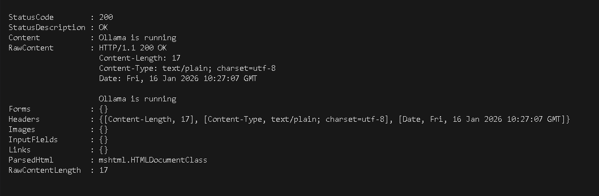

Le modèle `mistral:7b-instruct`, adapté au français. 
Un test a été réalisé via `ollama run` :   

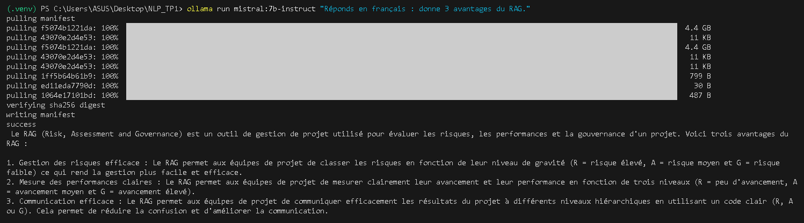

## Exercice 2 : 
admin_pdfs : 

la commande d’exécution du script

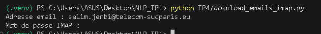

le nombre de fichiers créés dans TP4/data/emails/ : 27

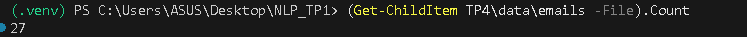

le contenu d’un email (début du fichier) avec head : 

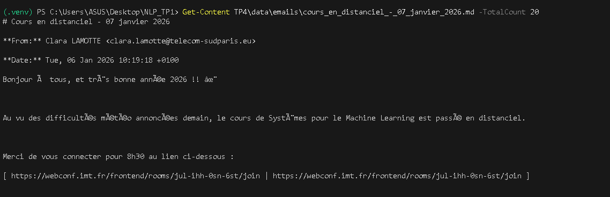

## Exercice 3 : 

la sortie console de python TP4/build_index.py (nb docs + nb chunks) : 

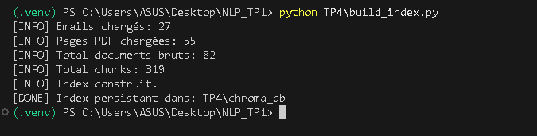

un ls -la TP4/chroma_db prouvant que l’index est créé : 

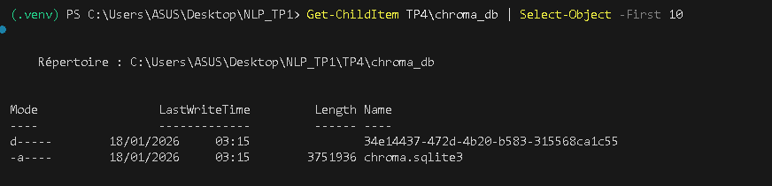

## Exercice 4 : 

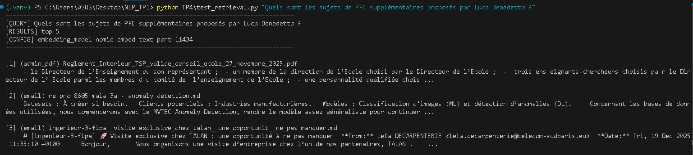

## Exercice 5 : 

une exécution complète de TP4/rag_answer.py :

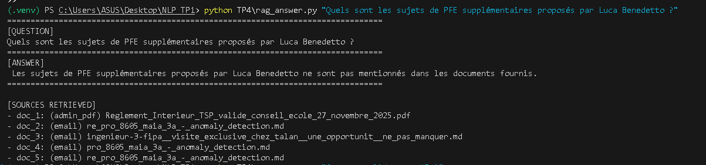

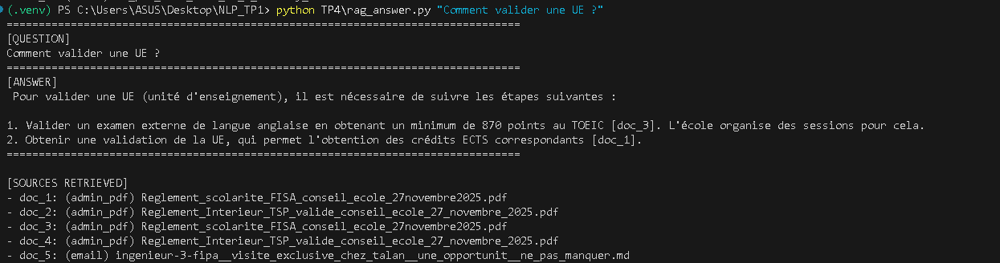

## Exercice 6 : 

votre fichier questions.json (un extrait) : 

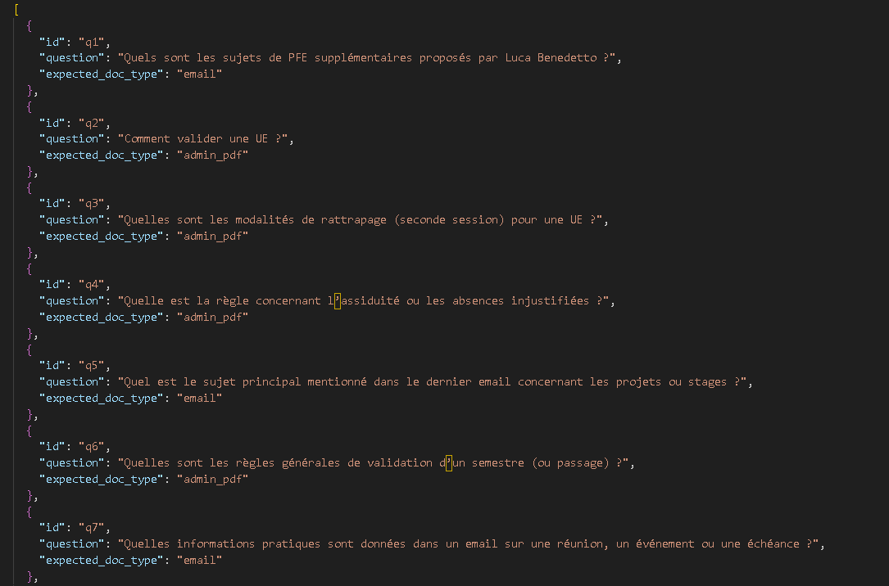

la sortie de python TP4/eval_recall.py avec le score final

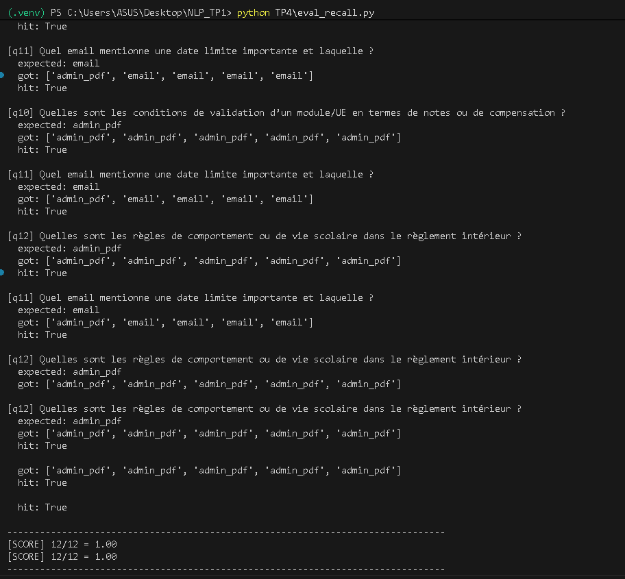

au moins une exécution de TP4/rag_answer.py sur une question de votre dataset

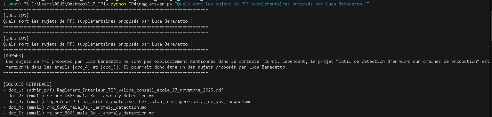

## Paragraphe final :

Globalement, le système fonctionne correctement pour répondre en français avec citations lorsque l’information est présente dans le corpus. Le retrieval retrouve souvent le bon type de document, mais certaines questions échouent lorsque les chunks pertinents ne remontent pas dans le top-k ou quand le contenu est trop dispersé. La principale limite observée est la sensibilité au chunking et au choix de k, ce qui peut empêcher d’obtenir la preuve nécessaire. Une amélioration prioritaire serait d’ajuster le chunking et d’augmenter TOP_K, voire d’ajouter un filtrage par doc_type pour réduire le bruit. Enfin, une évaluation plus robuste pourrait inclure une métrique basée sur des passages attendus plutôt que seulement le type de document.